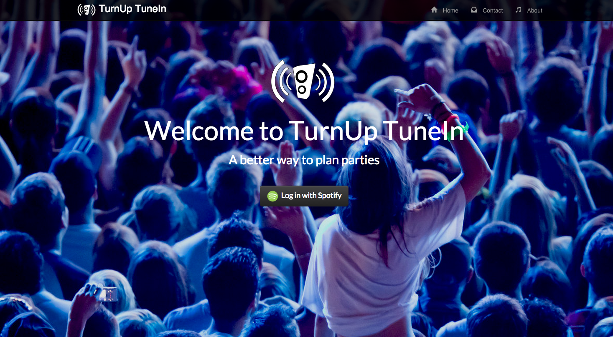

 

TurnUp TuneIn
=======================
[Visit the website](https://turnuptunein.herokuapp.com)
##Synopsis

##What is 'TurnUp TuneIn'?
A way to collaborate on creating a playlist, with the unique feature that the songs move with the person who chose them. You 'turn up' and your tunes go in. You leave and your tunes leave with you.

##How does it work?
A 'party planner' visits the website [TurnUp TuneIn](https://turnuptunein.herokuapp.com) where they;
- authorize TurnUp TuneIn to access and modify their Spotify Playlists
- register the unique details of a beacon (a simple type of bluetooth device)
- provide details of the party (name, date and a playlist name)

The site then provides a link that the party planner can send to their friends, so the friends can register their personal song choices.

On the night, party goers switch on their TurnUp TuneIn mobile app (with Bluetooth on!). This app gets the details of the beacon that the party planner has registered. When the phone is in range of the beacon, a message is sent to TurnUp TuneIn to say the party goer has arrived.

At this point the party goer's personal song choices are loaded into the party planner's Spotify Playlist.

Then when the party goer leaves the range of the beacon (around 50m) their mobile app sends another message to TurnUp TuneIn to say they have left the party. TurnUp TuneIn then removes that party goer's personal song choice from the party planner's Spotify Playlist.

##Technologies Used

###Front end
- JavaScript
- jQuery
- HTML & CSS

###Server
- NodeJS
- Express

###Database
- MongoDB
- Monk wrapper

###Testing tools
- Mocha
- Chai
- Selenium

##Challenges encountered

###Beacons
- When we started the project we didn't understand what a beacon was, but were all keen to incorporate 'Internet of Things' hardware to make the project more interesting.

###Mobile appication development
- This was new to the team (not covered in the course). Cordova was used to enable the app to be developed in JavaScript and compiled for Android. The app also needed to interact with the Bluetooth receiver, which added further challenges.

###Testing JQuery interactions
- Previously we had only tested front end features with Casper. Our use of JQuery meant we needed to use Selenium to run our feature tests, which was new technology to us.

###Using a different database
- Previous projects had focused on using databases in a Ruby/Rails/Postgres stack, which have easily determined relationships between data. In using Mongo (with a Monk API wrapper) we were able to implement a database quickly and flexibly, but needed to work through the relationships between data.

## Collaborators
- Andy Newman (http://www.github.com/andyg72)
- Hannah Carney (http://www.github.com/hannahcarney)
- Jack Rubio (http://www.github.com/jackrubio26)
- Marcin Walendzik (http://www.github.com/marcinwal)
- Matteo Manzo (http://www.github.com/matteomanzo)

##To do
- [ ] Describe potential feature enhancements
